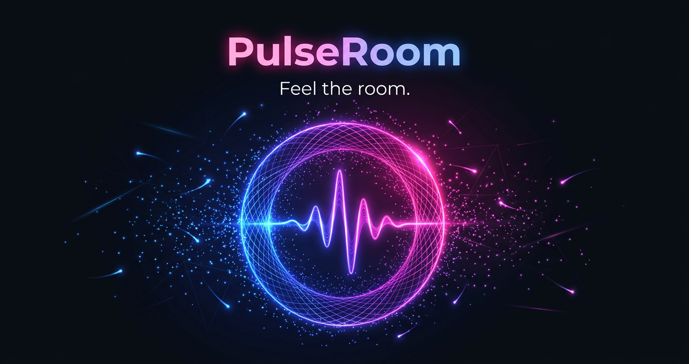

<p align="center">
  
</p>

<p align="center">
  <strong>Real-time</strong> · <strong>Anonymous</strong> · <strong>Ephemeral</strong>
</p>

<p align="center">
  <em>A weather system for a room of humans.</em>
</p>

<br>

---

## What is PulseRoom?

PulseRoom is a real-time, anonymous, ephemeral web room where a group of people share a single audiovisual environment that **reacts collectively** to how everyone in the room is feeling.

Create a room. Share the 6-character code. Tap an emoji. **Feel the room shift.**

> The background color drifts. Particles dance faster. The ambient soundscape rises in pitch. A live graph traces the room's emotional trajectory over the last 60 seconds.

It's the opposite of a chat room. Chat rooms are about explicit, attributable speech. **PulseRoom is about implicit, anonymous, collective vibe.**

---

## Use Cases

| For | Why PulseRoom |
|---|---|
| 🎓 **Classrooms** | A professor reads the room without stopping the lecture |
| 👥 **Team Retros** | Honest emotional signal without anyone having to speak |
| 📺 **Watch Parties** | A shared "we're feeling this together" surface |
| 🎤 **Conference Talks** | An ambient backchannel the speaker can *feel* |
| 🎮 **Livestreams** | Instant audience feedback without scrolling chat |

---

## Features

<div align="center">

| | | |
|---|---|---|
| 🚀 **One-click rooms** | 🎨 **Color drift** | 🔊 **Generative audio** |
| Create & share in seconds | Background shifts with mood | Ambient drone, opt-in audio |
| 😂 **5 emoji reactions** | ✨ **Particle field** | 📈 **Mood graph** |
| Confused · Hyped · Love · Laugh · Dead | Canvas particles dance to energy | 60-second rolling timeline |
| 🧠 **Mood engine** | 💓 **Breathing pulse** | 📸 **Snapshots** |
| Weighted reactions + natural decay | Heartbeat animated participant count | Freeze & share the moment |
| 🛡️ **Spam protection** | 🔗 **Late-joiner hydration** | ⏳ **Auto-expiry** |
| Rate-limited honest signal | Full history on arrival | Rooms vanish after 2h idle |
| 🔐 **No accounts. Ever.** | 🌙 **Reduced motion support** | 📱 **Fully responsive** |
| No sign-up, no login, no data | Respects OS accessibility prefs | Works on every screen size |

</div>

---

## Tech Stack

```
┌──────────────────────────────────────────────────────────┐
│                      PulseRoom                            │
├────────────────────┬─────────────────────────────────────┤
│   Frontend         │  React 19 · Vite 6 · Tailwind v4    │
│   (web/)           │  Framer Motion · Socket.io Client   │
│                    │  Web Audio API · Canvas 2D · SVG    │
├────────────────────┼─────────────────────────────────────┤
│   Backend          │  Node.js 20 · Express 5             │
│   (server/)        │  Socket.io · Zod · pino · helmet    │
├────────────────────┼─────────────────────────────────────┤
│   State            │  Upstash Redis (REST API)           │
├────────────────────┼─────────────────────────────────────┤
│   Hosting          │  Netlify (frontend, static SPA)     │
│                    │  Render (backend, Node process)      │
└────────────────────┴─────────────────────────────────────┘
```

---

## Getting Started

### Prerequisites

| Tool | Version | Check |
|---|---|---|
| Node.js | 20.x | `node -v` |
| pnpm | 9.x | `pnpm -v` |
| Git | any | `git --version` |

### Clone & Install

```bash
git clone https://github.com/rizinthehub/pulseroom.git
cd pulseroom

# Install server dependencies
cd server && pnpm install && cd ..

# Install web dependencies
cd web && pnpm install && cd ..
```

### Environment Variables

**`server/.env`**
```env
PORT=4000
NODE_ENV=development
UPSTASH_REDIS_REST_URL=https://your-db.upstash.io
UPSTASH_REDIS_REST_TOKEN=your-token
ALLOWED_ORIGINS=http://localhost:5173
```

**`web/.env.local`**
```env
VITE_SERVER_URL=http://localhost:4000
```

### Run Locally

```bash
# Terminal 1 — Backend (port 4000)
cd server && pnpm dev

# Terminal 2 — Frontend (port 5173)
cd web && pnpm dev
```

Open **[http://localhost:5173](http://localhost:5173)** → Create a room → Share the code → React.

---

## Project Structure

```
pulseroom/
├── server/                          # Node.js backend
│   ├── src/
│   │   ├── api/                     # REST routes + Zod validators
│   │   ├── config/                  # Environment + constants
│   │   ├── lib/                     # Logger, errors, ring buffer, tick scheduler
│   │   ├── redis/                   # Upstash Redis client + room store
│   │   ├── rooms/                   # Room class, manager, mood engine, code gen
│   │   ├── snapshots/               # Snapshot persistence + payload builder
│   │   ├── sockets/                 # WebSocket handlers + broadcasters + rate limiter
│   │   └── types/                   # Shared TypeScript definitions
│   └── tests/
│
├── web/                             # React SPA
│   ├── src/
│   │   ├── components/              # UI primitives + feature components
│   │   ├── lib/                     # Socket, audio engine, state, hooks, API client
│   │   ├── routes/                  # Landing, Room, Snapshot, 404
│   │   ├── styles/                  # CSS tokens, animations
│   │   └── types/                   # Mirrored server types
│   └── tests/
│
├── pulseroom-hero.png               # README hero image
└── README.md
```

---

## Design Principles

> **1. Anonymity is structural** — No identity is ever created, stored, or transmitted. Not even a session-scoped pseudonym.
>
> **2. Ephemerality is structural** — Rooms expire after 120 minutes of inactivity. No room data persists past expiry.
>
> **3. No text chat** — The product is non-verbal by design. Five emoji are all you need.
>
> **4. Audio is opt-in** — Muted by default. One click to unmute.
>
> **5. Five fixed reactions** — No custom emoji in MVP. Keeps the signal honest and clean.
>
> **6. Web only** — No native apps. Never.

---

## License

MIT

<br>

<p align="center">
  <sub>Built with ❤️ and zero user data.</sub>
</p>
